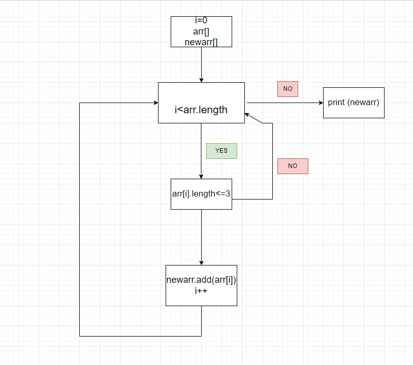

# Описание решения
Сначала создается массив строк *arr* и коллекция ArrayList *newarr*  
Затем создается итератор через цикл for, в котором проверяется длина символов одного отдельного элемента массива. Если символов меньше, либо равно 3, то значение ячейки массива добавляется в колеекцию *newarr*.  
Затем через еще один итерратор выводятся все элементы коллекции *newarr*, что собственно и выводит на экран решение поставленной нам задачи.  
## Блоксхема  
